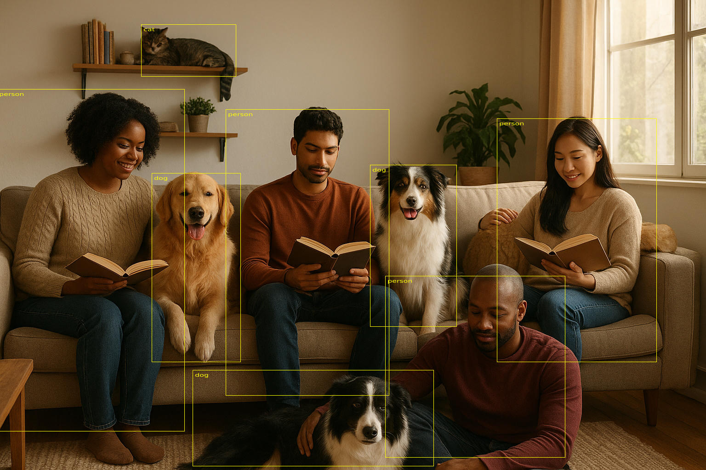

# Rust Single Shot Detection with Burn
**An implementation of Single Shot Detection (SSD) using the Burn deep learning framework in Rust.**

<figure>
    
    <figcaption>Uncanny image created with ChatGPT 🚀 🤔, object detection done with Rust-SSD 👍</figcaption>
</figure>

[](LICENSE) - (With Special Provisions for Burn)

## Table of Contents

- [Overview](#overview)
- [Features](#features)
- [Installation](#installation)
- [Usage](#usage)
- [Configuration](#configuration)
- [Inference](#inference)
- [Training](#training)
- [License](#license)
- [Acknowledgments](#acknowledgments)

# Overview

Rust SSD is an **object detection library** built in Rust using the [Burn](https://github.com/burn-rs/burn) framework. It implements the **Single Shot MultiBox Detector (SSD)** for detecting objects in images.  

#### Why SSD and Rust?

When I set out to create this project, I had a few questions I wanted to answer. I wanted to see if Rust was mature enough for me to implement a complex computer vision algorithm from scratch without reinventing the wheel. I also wanted to create a code base for a computer vision algorithm that tries as closely as possible to follow the original white paper. In addition, I wanted it to provide me with knowledge I could leverage in my day-to-day activities as a computer vision and embedded engineer. As well as something I could refer back to later on and refer others to for a reference.

Given this, I have spent almost as much time documenting the code as I spent implementing the algorithm. This is to say that the code base is intentionally over-documented to explain the nuances of how Single Shot Detection works at a fundamental level and is meant to be used as a learning tool.

#### The White Paper

In making this, I have thoroughly studied the white paper "SSD: Single Shot MultiBox Detector” and tried to implement this project as closely as possible to it and the references it draws from. If you'd like to download a copy it can be found here:

https://arxiv.org/abs/1512.02325 

# Getting Started

#### Pre-Trained Model Weights

I have prepared a pre-trained VGG model using the ONNX import option in Burn. This is used as the backbone for initial feature extraction. You can add this to the project using the ./scripts/get_models.sh script, or download it directly from here:

https://drive.google.com/drive/folders/1H-eqIdc-C6X6T7Q2xPqmWd4Pe-lmh-Kz

If you are only interested in trying to use if for inference and don't have the time or hardware to train, this link also contains an SSD 300 model trained with this code base to detect cats, dogs and people.

### Installation and Building The Project

#### Clone the repository:

```bash
git clone https://github.com/catch-twenty-two/rust-ssd.git
cd rust-ssd
```
#### Install the pretrained models using the `get_models.sh` script:

```bash
./scripts/get_models.sh 
```

#### Build the code base:

As is, the project requires you to have PyTorch installed and to have the Burn `LIBTORCH_USE_PYTORCH` flag set so libtorch is available for Burn to use as a Backend. 

More information on how LibTorch integrates with Burn is available here: 

https://github.com/tracel-ai/burn/blob/main/crates/burn-tch/README.md 


```bash
export LIBTORCH_USE_PYTORCH=1
cargo build --release
```

## Remapping the COCO Dataset Labels

In order to execute the rust-ssd application you will need to use the **same object order** that was used to train it using the --o option:

```
cargo run --release -- --o 'person,cat,dog' infer --p ./assets/images/sample1.png \ 
         --m ./assets/pretrained_models/ssd300-person-cat-dog.mpk
```

The --o option internally adds a translation from the COCO object labels to a smaller subset in order to make the training memory footprint much smaller and time to train much faster. In that respect, the COCO dataset you choose to use **is required to contain at least one of the objects from the --o labels** for each of the images it contains. So for instance, if you want to train on only bicycles, you need to filter all the COCO images by 'bicycle' then execute the binary with an --o parameter of --o 'bicycle' (You can filter a subset of images using one of the examples [shown below](#the-coco-dataset)). This option must be used for both inference and training.

# Usage
## Inference

Inference is done using the 'infer' directive, as demonstrated in the following command. Notice that the --o option matches the objects located in the .mpk file name in order *and* name.

```
cargo run --release -- --o 'person,cat,dog' infer --p ./assets/images/sample1.png \ 
         --i 0.9 --c 0.5 --m ./assets/pretrained_models/ssd300-person-cat-dog.mpk
```

Other options are:

 - **m** - The path of the SSD model to use for inference
 - **i** - The IOU threshold that overlapping boxes have in order to be considered one box 
 - **c** - The confidence level for the classification prediction in a box

This will produce a jpeg file in the same directory the process was executed in named `/ssd300_output.jpg` with annotated bounding boxes and labels.

## Training
Similar inference, training is done using the 'train' directive as demonstrated in the following command:
```
cargo run --release -- --o 'person,cat,dog' train --c 22  --r /home/mint/coco-2017/
```
 In both training and inference, the --o option is required and needs to match the objects called out in the .mpk file name in both order *and* name. 

  - **c** - Instructs the executable to begin training at a specific checkpoint, in this case it's 22. 
  - **r** - Provides ssd-rust the root folder path for the COCO dataset. In this example, the COCO root folder is considered to be `coco-2017` which has the following directory layout:
```
coco-2017/
├── annotations
├── raw
├── train
│   └── data
├── train2017
├── val2017
└── validation
    └── data
```
#### The COCO Dataset

The main reason COCO was chosen as a training set for this project is because the code base uses Burn, which contains APIs for processing the COCO libraries directly from disk. Therefore, training a model requires that you have the COCO dataset (or the part that you're interested in training on) installed locally; a subset of the 330k+ images can be obtained with various utilities. 

A couple of examples of these are:

https://github.com/voxel51/fiftyone

and

https://github.com/zzowenzz/COCO_Tiny (Extremely light weight)

#### Yes, but do I need an NVIDIA A-100 server farm?

One question you might be asking is am I able to train this using my PC? I would say in most cases yes; this is the set up I used and I was able to get fairly good results after about 1.5 days of training on about 4000 images:
```
OS: Linux Mint 22 x86_64 
Host: MS-7D40 2.0 
Kernel: 6.8.0-64-generic 
DE: Cinnamon 6.2.9 
CPU: 12th Gen Intel i7-12700F (20) @ 4.800GHz 
GPU: NVIDIA GeForce RTX 3070 Lite Hash Rate 
Memory: 18684MiB / 31939MiB                                
```
 Smaller object sets make a huge difference, so training for a couple of things like dogs and cats is much easier than training for 21 different classifications at once like in the paper. There is more detail on this in the code if you are interested. As is also stated in the white paper, image augmentation helps immensely with training, and there is a fairly extensive tensor based augmentation library in the code base that I created to help with this.

#### Ok, But can I train it to detect X?

Yes, you can train it to detect multiple objects in whatever categories you want, as long as you have enough data labeled in the same format as the COCO dataset and powerful enough hardware to train with.

## One other interesting (or not so interesting bit) 🤖

Normally, I wouldn’t mention this in a README, but this is the first time that I’ve really leaned on and leveraged AI to create a project. 🚀

Many of the test images I've used, along with much of the documentation, were created with ChatGPT. I wanted to note this because, as of 2025, there’s still a certain stigma around using AI in coding projects. I found that AI made some things much easier, mainly for the uninteresting and mundane parts of writing code, such as some unit tests and most of the doc comments. It definitely has its advantages, but when it comes to figuring out hard problems, (the interesting and creative part of coding), most of the time it's not too helpful.

## Features

A few other things to mention about this project

- It is a 100% Pure Rust implementation of **SSD Object Detection**.  
- Hyperparameters are configurable via a JSON file in ./config/.  
- These hyperparameters also include a seeded option so results should be reproducible with seeded training. (I haven't tested this.)
- It contains a 100% tensor based implementations of image augmentations and their associated bounding box and label augmentations including:
  - clean (my implementation of sanitize)
  - horizontal flip
  - vertical flip
  - normalization using ImageNet metrics
  - brightness
  - contrast
  - bilinear resize
  - hue rotate
  - photometric distort
  - save image - with optional bounding box overlays and labels
  - zoom out
  - complementary image colors - for improved visibility of image annotations

# Configuration

Training and hyperparameters are configurable via JSON in `./config/training_config.json`:
```
{
  "optimizer": {
    "type": "sgd",
    "momentum": 0.9,
    "weight_decay": 0.0
  },
  "num_epochs": 100,
  "batch_size": 20,
  "num_workers": 1,
  "seed": 1,
  "learning_rate": 0.001
}
```

The initial settings should be a good starting point to train from.

From the paper:


" We first train the model with 10−3 learning rate for 160k iterations, and then continue training for 40k iterations with 10−4 and 40k iterations with 10−5."

## File Layout

Here is the file layout of a fully configured project

```
.
├── artifacts
│   └── checkpoints
├── assets
│   ├── docs
│   ├── fonts
│   ├── images
│   └── pretrained_models
├── config
├── scripts
├── src
│   ├── models
│   └── transforms
├── target
│   ├── debug
│   └── release
└── tests
```

# Acknowledgments  
- Inspired by the original [SSD paper (Liu et al., 2016)](https://arxiv.org/abs/1512.02325).  
- Built using the [Burn](https://github.com/burn-rs/burn) deep learning framework.  
- Thanks to the Burn ML community for support in getting this working.

# License  
This project is licensed under the **GNU General Public License v3.0 (GPLv3)**.  

By using, copying, modifying, or distributing this software, you agree to be bound by the terms of the GPLv3 with special provisions for [The Burn Deep Learning Framework](https://github.com/burn-rs/burn). For full details, see the [LICENSE](LICENSE) file included with this repository.

**Key keywords for discoverability:** `Rust`, `SSD`, `Single Shot Detection`, `Burn`, `Object Detection`, `Deep Learning`, `Machine Learning`, `Computer Vision`.  


